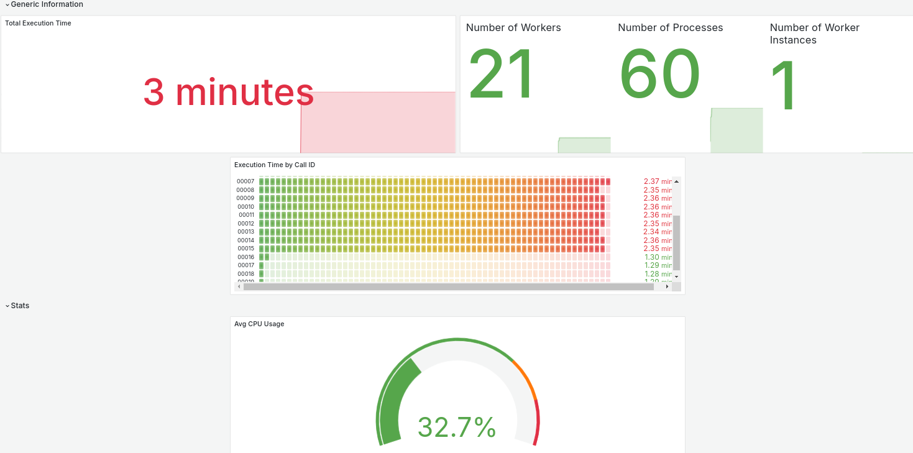
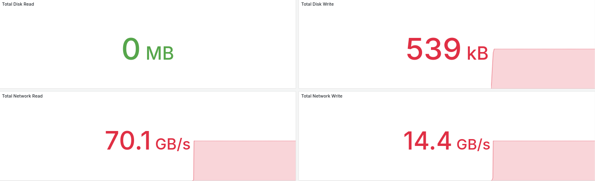
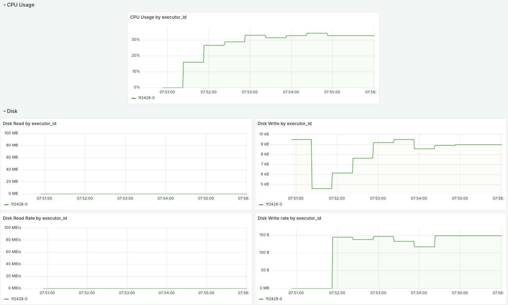
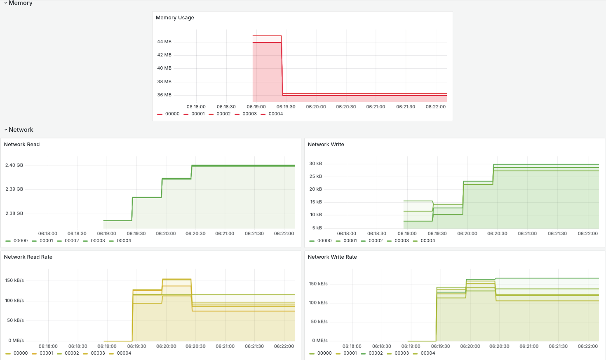

Grafana Configuration Guide
============================

This guide explains how to configure **Grafana** to visualize the metrics collected by **Lithops Profiler** using **Prometheus Pushgateway**. Follow these steps to set up Grafana, connect it to Prometheus, and import pre-configured dashboards for effective monitoring.

Prerequisites
-------------

Before starting the Grafana setup, ensure you have the following prerequisites:

- **Prometheus** and **Prometheus Pushgateway** are already installed and configured to receive metrics from Lithops.
- **Grafana** is installed on your system or server.
- **Prometheus** is running and accessible, with the `pushgateway_url` correctly configured in `lithops_config`.

If any of these are missing, refer to the appropriate installation guides.

1. Install Grafana
-------------------

To install **Grafana**, follow the official installation instructions for your operating system from the [Grafana Installation Guide](https://grafana.com/docs/grafana/latest/setup-grafana/installation/).

This guide covers installation for multiple platforms, including:

- Ubuntu/Debian
- Red Hat/CentOS
- Windows
- Docker

2. Start the Grafana Service
----------------------------

Once Grafana is installed, start the service:

**Linux Systems (Ubuntu/Debian/Red Hat)**

.. code-block:: bash

    sudo systemctl start grafana-server
    sudo systemctl enable grafana-server

You can now access the Grafana web interface by navigating to `http://localhost:3000` in your browser. The default login credentials are:

- Username: `admin`
- Password: `admin`

For other systems, such as Windows or Docker, refer to the instructions in the [Grafana Installation Guide](https://grafana.com/docs/grafana/latest/setup-grafana/installation/).

3. Add Prometheus as a Data Source
----------------------------------

Now that Grafana is running, you need to configure **Prometheus** as a data source. Follow these steps:

1. Log into the Grafana web interface.
2. In the left-hand menu, click on **Connections**, then select **Data Sources**.
   
3. Click the **Add data source** button.
4. Select **Prometheus** from the list.
5. In the **URL** field, enter the URL of your Prometheus server. If Prometheus is running on the same server, this is likely:

   .. code-block:: text

       http://localhost:9090

6. In the **Name** field, ensure the name is set to `prometheus` (all in lowercase). This is important to avoid any configuration issues with dashboards that expect this name.
   
7. Click **Save & Test**. Grafana will now attempt to connect to Prometheus. If the connection is successful, you should see a green message saying **Data source is working**.

4. Import Pre-Configured Dashboards
-----------------------------------

To save time and quickly set up your **Lithops** monitoring environment, you can import pre-configured Grafana dashboards. The dashboards are provided in the **dashboards** folder inside the **docs** directory of this project.

We provide four dashboards, each tailored to monitor different aspects of the **Lithops** environment:

- **Detailed Dashboard by Executor ID**: Displays detailed metrics for Lithops executions, filtered by Executor ID.
- **Detailed Dashboard per Call ID**: Shows detailed metrics for each specific call within Lithops executions.
- **General Performance Dashboard of the Executor**: Provides a general overview of the performance of all Lithops executors.
- **Generic Dashboard**: A general-purpose dashboard that can be customized for broader use cases.

To import these dashboards, follow these steps:

1. In the Grafana interface, click on the **Dashboards** (four-square icon) on the left-hand menu.
2. Click the **Import** button.
3. In the **Upload JSON file** section, click **Choose file** and navigate to the **dashboards** folder inside the **docs** directory of this project.
4. Select the desired JSON file corresponding to the dashboard you want to import:
   - `Detailed Dashboard by Executor ID.json`
   - `Detailed Dashboard per Call ID.json`
   - `General Performance Dashboard of the Executor.json`
   - `Generic Dashboard.json`
5. After loading the JSON file, you will see an option to **Select a Prometheus Data Source**. Make sure to select the **prometheus** data source that you created earlier.
6. Click **Load** and then **Import** to add the dashboard to your Grafana environment.

Each dashboard will automatically populate with the relevant Prometheus metrics once imported, allowing you to start monitoring your Lithops environment immediately.

5. Dashboard Examples
----------------------

Below are some screenshots of the pre-configured dashboards to give you a preview of how they look once set up:

Final Notes
-----------

By following this guide, you should now have Grafana configured to visualize Lithops Profiler metrics collected via Prometheus Pushgateway. If needed, you can modify the provided dashboards or create your own based on your specific requirements.

For any issues or additional features, refer to the [Grafana Documentation](https://grafana.com/docs/grafana/latest/).
